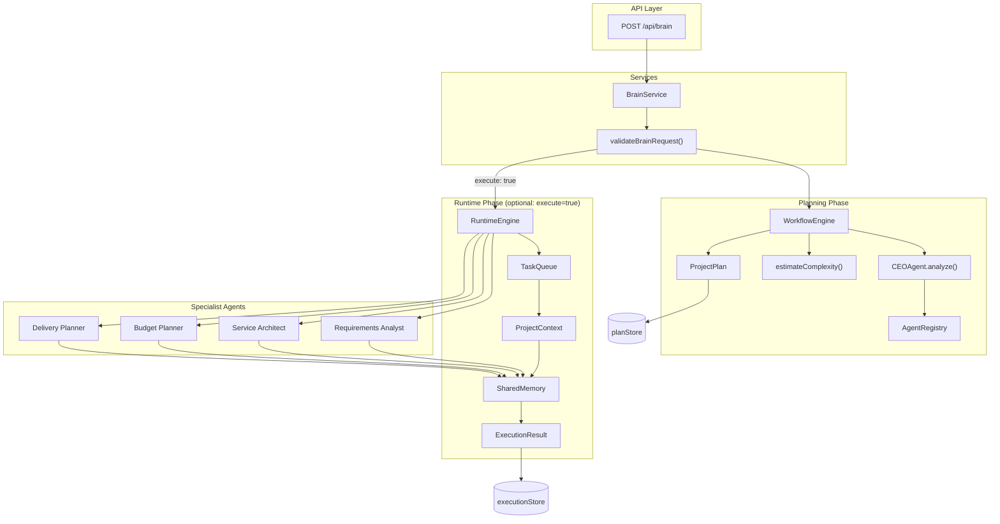

# Nexora Brain

Nexora Brain is a modular multi-agent orchestration engine for Nexora AI. It analyzes project requests, assigns specialist agents, produces structured execution plans, and **executes those plans** through a runtime engine — without generating websites, code, or deliverables directly.

This is the **foundation layer**, not the final AI system. It is designed to be extended with additional agents, tools, and persistence as the platform matures.

## Architecture

```
src/brain/
├── agents/          # Agent implementations (CEO + specialists)
├── core/            # WorkflowEngine, RuntimeEngine, TaskQueue
├── knowledge/       # Centralized business knowledge (industries, services, pricing)
├── reasoning/       # Strategic reasoning engines (analysis, opportunities, strategy)
├── sdk/             # Department SDK — shared foundation for all departments
├── registry/        # Agent registration and discovery
├── workflows/       # Workflow definitions and validation
├── memory/          # Plan store, execution store, SharedMemory
├── prompts/         # Prompt templates and capability maps
├── schemas/         # Request validation
├── services/        # Facade / bootstrap layer
├── tools/           # Future tool catalog for agent actions
└── types/           # Shared TypeScript interfaces
```

### System Diagram



### Planning Flow

```
POST /api/brain
    │
    ▼
BrainService (validate → plan → store)
    │
    ▼
WorkflowEngine
    │
    ├── CEOAgent.analyze()     ← decides agents + tasks + order
    ├── AgentRegistry          ← discovers compatible agents
    └── estimateComplexity()   ← scores project difficulty
    │
    ▼
ProjectPlan (JSON)
```

### Runtime Flow

```
POST /api/brain  { execute: true }
    │
    ▼
BrainService → WorkflowEngine.plan()
    │
    ▼
RuntimeEngine.execute(plan)
    │
    ├── TaskQueue.fromPlan()        ← CEO tasks enqueued by priority
    ├── SharedMemory (new)          ← stores every agent output
    ├── ProjectContext (shared)     ← same context for all agents
    │
    └── for each task (sequential):
            agent.execute(task, context)
            context.memory.record(result)
    │
    ▼
ExecutionResult
    ├── agentResults[]     ← every AgentResult
    └── mergedOutput       ← unified project output
```

## Core Concepts

### Agent Interface

Every agent implements:

| Method / Property | Purpose |
|---|---|
| `id` | Unique identifier |
| `name` | Human-readable name |
| `description` | Role summary |
| `canHandle(task)` | Returns true if the agent can execute the task |
| `execute(task, context)` | Runs the task and returns an `AgentResult` |

Agents receive `AgentContext` (planning) or `ProjectContext` (runtime). `ProjectContext` extends `AgentContext` with `plan` and `memory` — fully backward compatible.

### ProjectContext & Shared Memory

During runtime execution, every agent receives the same `ProjectContext`:

```typescript
interface ProjectContext extends AgentContext {
  plan: ProjectPlan;
  memory: SharedMemory;   // read prior agent outputs
}
```

`SharedMemory` records each `AgentResult` so downstream agents can access upstream outputs within the same execution.

### Task Queue

`TaskQueue.fromPlan(plan, registry)` converts CEO-generated tasks into an ordered execution queue:

- Tasks sorted by `priority`
- Agent assignment from plan or registry fallback
- FIFO dequeue for sequential execution
- `buildExecutionBatches()` prepares future parallel/DAG execution

### Runtime Engine

```typescript
import { getRuntimeEngine } from "@/src/brain";

const runtime = getRuntimeEngine();
const execution = await runtime.execute(plan);
```

| Option | Default | Description |
|---|---|---|
| `mode` | `"sequential"` | `"parallel"` reserved for future DAG batches |
| `stopOnFailure` | `true` | Halt queue on first failed task |

Returns `ExecutionResult`:

| Field | Description |
|---|---|
| `status` | `pending` \| `running` \| `completed` \| `failed` |
| `agentResults` | Array of every agent output |
| `mergedOutput` | Unified `{ tasks, byAgent, byType, summary }` |
| `tasksCompleted` / `tasksTotal` | Progress counters |

### CEO Agent

The CEO Agent orchestrates — it never builds deliverables. It:

1. Receives a `ProjectRequest`
2. Analyzes industry, goal, budget, and services
3. Determines required capabilities
4. Builds a task list and execution order
5. Assigns compatible specialist agents

### Agent Registry

```typescript
import { AgentRegistry } from "@/src/brain";

const registry = new AgentRegistry();
registry.register(myAgent);

registry.get("my-agent");
registry.getAll();
registry.findCompatibleAgents(task);
```

### Workflow Engine

```typescript
import { getWorkflowEngine } from "@/src/brain";

const engine = getWorkflowEngine();
const plan = engine.plan({
  industry: "HVAC",
  goal: "Generate leads",
  budget: 3000,
  services: ["website", "chatbot"],
});
```

## API

### `POST /api/brain`

**Plan only (default — backward compatible):**

```json
{
  "industry": "HVAC",
  "goal": "Generate leads",
  "budget": 3000,
  "services": ["website", "chatbot"]
}
```

**Plan + execute:**

```json
{
  "industry": "HVAC",
  "goal": "Generate leads",
  "budget": 3000,
  "services": ["website", "chatbot"],
  "execute": true
}
```

**Response (with execution):**

```json
{
  "success": true,
  "plan": { "...": "..." },
  "execution": {
    "requestId": "...",
    "status": "completed",
    "mode": "sequential",
    "agentResults": [...],
    "mergedOutput": {
      "summary": { "totalTasks": 5, "successfulTasks": 5, "allSuccessful": true },
      "tasks": { "...": "..." },
      "byAgent": { "...": "..." },
      "byType": { "...": "..." }
    },
    "tasksCompleted": 5,
    "tasksTotal": 5,
    "startedAt": "...",
    "completedAt": "..."
  }
}
```

### `GET /api/brain`

Returns service metadata and usage example.

## Creating a New Agent

1. **Create the agent file** in `src/brain/agents/`:

```typescript
import { BaseAgent } from "./base-agent";
import type { AgentContext } from "../types/agent";
import type { AgentTask } from "../types/project";

export class MySpecialistAgent extends BaseAgent {
  readonly id = "my-specialist";
  readonly name = "My Specialist";
  readonly description = "Handles a specific planning task.";

  canHandle(task: AgentTask): boolean {
    return task.type === "my_task_type";
  }

  async execute(task: AgentTask, context: AgentContext) {
    // Optional: read prior outputs when running in runtime
    const memory = "memory" in context ? context.memory : undefined;
    const prior = memory?.getByAgent("requirements-analyst");

    return this.success(task, {
      insight: "Planning output here",
      priorSteps: prior?.length ?? 0,
    });
  }
}
```

2. **Register capability metadata** in `src/brain/prompts/ceo-analysis.ts` (`AGENT_CAPABILITIES`).

3. **Add to default bootstrap** in `src/brain/agents/index.ts` (`createDefaultSpecialistAgents`).

4. **Extend CEO task building** in `src/brain/agents/ceo-agent.ts` if the agent needs new task types.

5. **Update workflow steps** in `src/brain/workflows/default-workflow.ts` if needed.

## Built-in Agents

| Agent | ID | Responsibility |
|---|---|---|
| CEO Agent | `ceo-agent` | Orchestration and plan generation |
| Requirements Analyst | `requirements-analyst` | Extracts structured requirements |
| Service Architect | `service-architect` | Maps services to deliverables |
| Budget Planner | `budget-planner` | Validates budget vs scope |
| Delivery Planner | `delivery-planner` | Sequences milestones and handoff |

## Design Principles

- **Orchestration only** — agents plan; they do not generate websites or code
- **Knowledge-driven** — business facts live in `knowledge/`; agents consume via `KnowledgeRegistry`
- **No external AI frameworks** — pure TypeScript, no LangGraph/CrewAI/AutoGen
- **No database** — in-memory store for now; swap via `memory/` module
- **No RAG / vector DB** — not in scope for this foundation
- **Extensible** — new agents, tools, and workflows plug in via registry
- **Isolated** — lives under `src/brain/`; does not modify existing website UI or routes
- **Backward compatible** — plan-only API unchanged; execution is opt-in via `execute: true`

## Knowledge Layer

Nexora Brain separates **logic from business knowledge**. All industry profiles, service definitions, pricing ranges, playbooks, and proposal templates live under `src/brain/knowledge/`.

Agents access knowledge exclusively through `KnowledgeRegistry`:

```typescript
import { getKnowledgeRegistry } from "@/src/brain";

const knowledge = getKnowledgeRegistry();
const profile = knowledge.getIndustry("HVAC");
const priceRange = knowledge.estimatePriceRange(["website", "chatbot"]);
const playbook = knowledge.getPlaybook("hvac-lead-generation");
```

| Module | Purpose |
|---|---|
| `industries/` | Business goals, pain points, KPIs, recommendations per vertical |
| `services/` | Service definitions, deliverables, complexity, timelines |
| `pricing/` | Configurable CAD pricing ranges — not hardcoded in agents |
| `playbooks/` | Repeatable engagement patterns per industry |
| `templates/` | Proposal assumptions, milestones, next steps |
| `prompts/` | Knowledge-backed prompt templates |

See [`knowledge/README.md`](./knowledge/README.md) for full documentation.

## Strategic Reasoning Layer

The reasoning layer performs pure business analysis — no website, code, or marketing generation. It consumes the Knowledge Layer plus sales/proposal outputs to produce strategy, solutions, roadmaps, and impact projections.

```typescript
import { StrategicReasoner } from "@/src/brain";

const reasoner = new StrategicReasoner();
const input = reasoner.buildInput({ requestId: "req-001", request });
const { result } = reasoner.reason(input);
// result.strategy, result.solution, result.roadmap, result.expectedImpact
```

| Engine | Responsibility |
|---|---|
| `BusinessAnalysisEngine` | SWOT, customer journey, growth bottlenecks |
| `OpportunityEngine` | Automation, AI, marketing, ops, revenue opportunities |
| `RecommendationEngine` | Scored, prioritized recommendations with rationale |
| `SolutionDesigner` | Complete integrated business solution design |
| `StrategicReasoner` | Orchestrates all engines into strategic output |

See [`reasoning/README.md`](./reasoning/README.md) for full documentation.

## Department SDK

The Department SDK (`src/brain/sdk/`) provides a common foundation for current and future departments — validation, context, telemetry, lifecycle, and registry. Existing departments are unchanged; new departments extend `BaseDepartment`.

See [`sdk/README.md`](./sdk/README.md) for the extension guide.

## Future Extensions

- DAG-based parallel execution via `buildExecutionBatches()`
- Persistent plan/execution storage (Supabase, Redis)
- LLM-powered CEO analysis (optional augmentation)
- Tool integrations (CRM, calendar, email)
- Agent-to-agent messaging bus
- Admin dashboard for plan review
