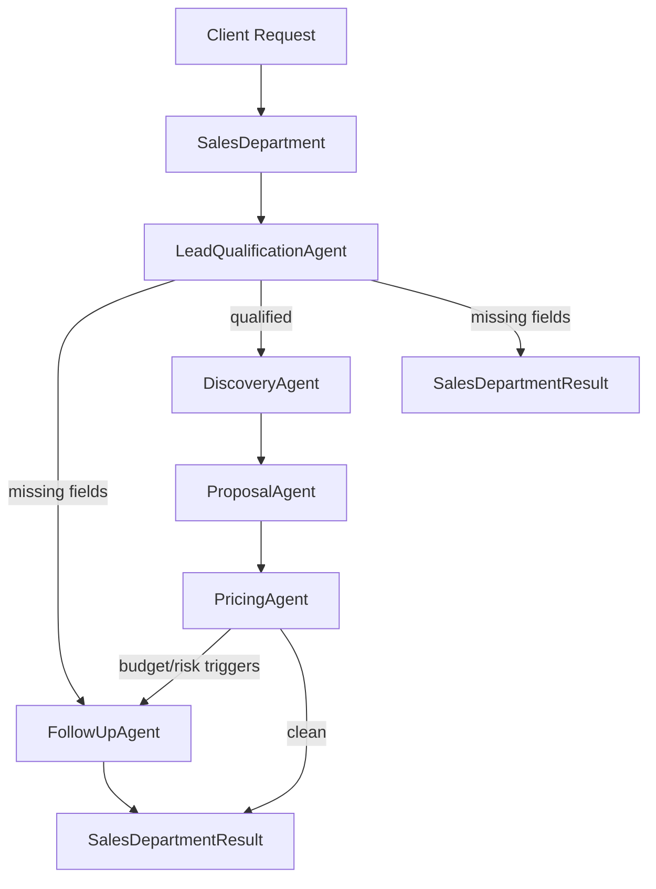

# Sales Department

The Sales Department is Nexora Brain's first **department module** — a composable multi-agent unit that handles project discovery and client qualification. It replaces the monolithic Sales Agent with independent, replaceable sub-agents orchestrated by a single department entry point.

## Architecture

```
Sales Department (sales-department)
    │
    ├── LeadQualificationAgent   → validate required client fields
    ├── DiscoveryAgent           → business discovery analysis
    ├── ProposalAgent            → structured proposal outline
    ├── PricingAgent             → pricing, timeline, complexity, risks
    └── FollowUpAgent            → follow-up actions (when required)
```

### Pipeline Flow



### Execution Order

1. **Lead Qualification** — always runs first
2. **Discovery** — only when lead is qualified
3. **Proposal** — only when lead is qualified
4. **Pricing** — only when lead is qualified
5. **Follow-Up** — only when required:
   - Missing required fields
   - Budget misalignment
   - High-severity risks
   - Regulated industry compliance review

## Shared Context & Memory

Every sub-agent receives the same `ProjectContext`:

```typescript
interface ProjectContext extends AgentContext {
  plan: ProjectPlan;
  memory: SharedMemory;  // shared across all department steps
}
```

After each step, the department records the `AgentResult` in `SharedMemory`. Downstream agents read prior outputs (e.g. Discovery reads Lead Qualification from memory).

## Registration

Only **SalesDepartment** is registered in the main `AgentRegistry`. Sub-agents are internal and injected via constructor options:

```typescript
import { SalesDepartment, LeadQualificationAgent } from "@/src/brain";

const department = new SalesDepartment({
  agents: {
    leadQualification: new LeadQualificationAgent(),
    // replace any sub-agent independently
  },
});
```

CEOAgent assigns `qualify_client` tasks to `sales-department` automatically.

## Required Client Fields

| Field | Source |
|---|---|
| Business name | `metadata.businessName` |
| Industry | `request.industry` |
| Country | `metadata.country` |
| Target audience | `metadata.targetAudience` |
| Services | `request.services` |
| Goals | `request.goal` |
| Budget | `request.budget` (> 0) |
| Timeline | `metadata.timeline` |

## Output: SalesDepartmentResult

```typescript
interface SalesDepartmentResult {
  departmentId: "sales-department";
  status: "needs_clarification" | "qualified";
  stepsExecuted: string[];
  stepsSkipped: string[];
  stepResults: SalesDepartmentStepResult[];
  leadQualification?: LeadQualificationOutput;
  discovery?: DiscoveryOutput;
  proposal?: ProposalOutput;
  pricing?: PricingOutput;
  followUp?: FollowUpOutput;
  summary: string;
  nextStep: string;
}
```

## Sub-Agent Responsibilities

| Agent | ID | Output |
|---|---|---|
| Lead Qualification | `lead-qualification-agent` | Field completeness, clarification questions |
| Discovery | `discovery-agent` | Business analysis, discovery notes |
| Proposal | `proposal-agent` | Project summary, scope outline, recommended services |
| Pricing | `pricing-agent` | Price range, timeline, complexity, risks |
| Follow-Up | `follow-up-agent` | Required actions, contact window |

## Design Principles

- **No website generation** — discovery and qualification only
- **No marketing copy** — structured business analysis only
- **Independent agents** — each implements the standard `Agent` interface
- **Replaceable** — inject custom agents via `SalesDepartmentOptions`
- **Backward compatible** — `SalesAgent` is an alias for `SalesDepartment`
- **Shared memory** — agents collaborate through `ProjectContext.memory`

## Example Usage

```typescript
import {
  SalesDepartment,
  SALES_EXAMPLE_COMPLETE_REQUEST,
} from "@/src/brain";

const department = new SalesDepartment();
const task = {
  id: "task-1",
  type: "qualify_client",
  description: "Qualify HVAC client",
  requiredCapabilities: [],
  priority: 0,
};

const result = await department.execute(task, {
  requestId: "req-1",
  request: SALES_EXAMPLE_COMPLETE_REQUEST,
});

const output = result.output as SalesDepartmentResult;
console.log(output.status);        // "qualified"
console.log(output.stepsExecuted); // ["lead-qualification-agent", ...]
```

## File Structure

```
agents/sales/
├── department/
│   ├── sales-department.ts          # Orchestrator
│   ├── lead-qualification-agent.ts
│   ├── discovery-agent.ts
│   ├── proposal-agent.ts
│   ├── pricing-agent.ts
│   ├── follow-up-agent.ts
│   └── index.ts
├── shared/
│   ├── constants.ts
│   ├── profile.ts
│   ├── analysis.ts
│   ├── pricing.ts
│   └── follow-up.ts
├── examples.ts                       # Unit-test-ready requests
├── qualification.ts                  # Backward-compatible re-exports
└── README.md
```
